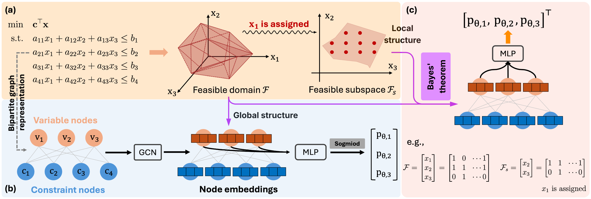

<!-- # 🔧 Project Title -->

## Learning Decision Space Structure for Efficient Solution of Mixed-Integer Linear Programs

---

## 📖 Introduction

This repository provides a complete pipeline for learning the structure of MILP decision spaces using machine learning techniques. It integrates data preprocessing, instance generation, model training, and evaluation on real and synthetic benchmarks.

<p align="center">
  
</p>

*Figure 1: Overview of the proposed framework.*

---

## 📁 Repository Structure

<pre> 
```bash
ML4CO/ 
├── dataset/ # Raw and processed data 
├── instances/ # MILP instances for testing 
├── models/ # Saved model checkpoints and configs 
├── src/ # Source code (training, evaluation, utilities) 
├── .gitattributes # Git metadata settings 
└── README.md # Project overview and usage guide
```
</pre>


---

## 🚀 Getting Started

### 1. Clone the repository
```bash
git clone https://github.com/ML4OPT/DS_MILP.git
cd DS_MILP


conda create -n [YOUR-ENV] python=3.10
conda activate [YOUR-ENV]
pip install -r requirements.txt
```

### 2. Generate data
```bash

python src/generateParentILPs.py
python src/generateCHildrenILPs.py

```


### 3. Run experiments
```bash

python src/main.py

```


---


### Cite our work

```bash

@misc{your_project2024,
  author       = {Yadong Zhang, Pranav M Karve, Sankaran Mahadevan},
  title        = {Learning Decision Space Structure for Efficient Solution of Mixed-Integer Linear Programs},
  year         = {2025},
  howpublished = {GitHub},
  url          = {https://github.com/jeff-public/ML4CO}
}

```